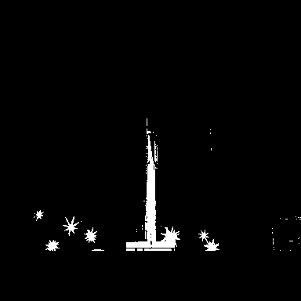

# RLE Image Compression (BMP + Scan Modes)

This project benchmarks lossless hybrid RLE compression on indexed BMP images using three scan modes.

- BMP formats: `bw_1bit`, `gray_4bit`, `palette_8bit`
- Scan modes (RLE traversal): `row_major`, `col_major`, `zigzag_64`
- Source: default `skimage_rocket` (or user image with `--input-image`)
- Validation: decode output is checked pixel-by-pixel (lossless)

## Run

```bash
pip install -r requirements.txt
python run_pipeline.py
```

Optional external input:

```bash
python run_pipeline.py --input-image path/to/image.png
```

## Project Layout

Requested pipe-style structure:

```text
|
|-- run_pipeline.py
|
|-- src
|   |
|   |----- rle_image_compression
|          |--------- dataset.py
|          |--------- bmp_codec.py
|          |--------- scans.py
|          |--------- rle_codec.py
|          |--------- pipeline.py
|
|-- images
|   |
|   |----- generated_sources
|   |----- previews
|   |----- bmp
|   |----- decompressed
|   |----- pixel_values
|
|-- results
|   |
|   |----- compression_results.csv
|   |----- compression_results.json
|   |----- block64_results.csv
|   |----- block64_bmp_scan_comparison.csv
|   |----- bmp_scan_summary.csv
|   |----- results_tables.md
```

## Report Strategy (Not Pushed)

Report generation logic is moved to a local-only area and excluded from git:

- Local report builder code: `local/reporting/report_builder.py`
- Local report output: `local/reports/REPORT.md`
- Git behavior: `local/` is ignored in [\.gitignore](.gitignore)

This keeps report creation available on your machine without pushing report tooling/artifacts.

## Source and BMP Visuals

Default source image:


BMP-type preview images (PNG previews so GitHub renders correctly):

### bw_1bit


### gray_4bit


### palette_8bit


## Main Results (Markdown Tables)

### Global Performance by BMP Type

| BMP Type | Row Major (%) | Col Major (%) | Zigzag 64 (%) | Best Scan |
|---|---:|---:|---:|---|
| bw_1bit | 78.61 | 82.62 | 72.10 | col_major |
| gray_4bit | 44.43 | 46.34 | 35.82 | col_major |
| palette_8bit | 34.26 | 28.91 | 25.65 | row_major |

### Block-Winner Counts by BMP Type (64x64)

| BMP Type | Row Wins | Col Wins | Zigzag Wins |
|---|---:|---:|---:|
| bw_1bit | 52 | 11 | 1 |
| gray_4bit | 40 | 24 | 0 |
| palette_8bit | 55 | 8 | 1 |

### Full 3x3 Matrix

| BMP Type | Scan Mode | Original (bytes) | Compressed (bytes) | Compression Rate (%) | Compression Performance (%) | Lossless |
|---|---|---:|---:|---:|---:|---|
| bw_1bit | row_major | 32830 | 7022 | 21.39 | 78.61 | True |
| bw_1bit | col_major | 32830 | 5706 | 17.38 | 82.62 | True |
| bw_1bit | zigzag_64 | 32830 | 9161 | 27.90 | 72.10 | True |
| gray_4bit | row_major | 131190 | 72904 | 55.57 | 44.43 | True |
| gray_4bit | col_major | 131190 | 70397 | 53.66 | 46.34 | True |
| gray_4bit | zigzag_64 | 131190 | 84197 | 64.18 | 35.82 | True |
| palette_8bit | row_major | 263222 | 173033 | 65.74 | 34.26 | True |
| palette_8bit | col_major | 263222 | 187130 | 71.09 | 28.91 | True |
| palette_8bit | zigzag_64 | 263222 | 195702 | 74.35 | 25.65 | True |

## Interpretation: Which Format + Which RLE Traversal Works Better?

- `bw_1bit`: `col_major` works best globally.
- `gray_4bit`: `col_major` works best globally.
- `palette_8bit`: `row_major` works best globally.

Block-level behavior is format-dependent and does not always match a single universal winner across all BMP types.

## Output Files

- [results/compression_results.csv](results/compression_results.csv)
- [results/compression_results.json](results/compression_results.json)
- [results/block64_results.csv](results/block64_results.csv)
- [results/block64_results.json](results/block64_results.json)
- [results/block64_bmp_scan_comparison.csv](results/block64_bmp_scan_comparison.csv)
- [results/block64_bmp_scan_comparison.json](results/block64_bmp_scan_comparison.json)
- [results/block64_value_features.csv](results/block64_value_features.csv)
- [results/block64_value_features.json](results/block64_value_features.json)
- [results/bmp_scan_summary.csv](results/bmp_scan_summary.csv)
- [results/bmp_scan_summary.json](results/bmp_scan_summary.json)
- [results/results_tables.md](results/results_tables.md)
