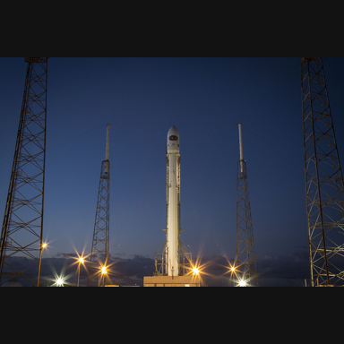

# RLE Image Compression Benchmark

Lossless hybrid RLE compression benchmark on indexed BMP images with three scan modes.

## Overview

- Image variants: `bw_1bit`, `gray_4bit`, `palette_8bit`
- Scan modes: `row_major`, `col_major`, `zigzag_64`
- Default source: `skimage.data.rocket()`
- Preprocess: aspect-ratio preserved + square padding (`384x384`)
- Validation: all encoded files are decoded and compared pixel-by-pixel

## Quick Start

```bash
pip install -r requirements.txt
python run_pipeline.py
```

Run with external input:

```bash
python run_pipeline.py --input-image path/to/image.png
```

## Professional Project Structure

```text
RLE-Image-Compression/
|-- run_pipeline.py                          # CLI entrypoint: runs the full experiment pipeline
|-- requirements.txt                         # Python dependencies
|-- README.md                                # Project documentation
|-- src/
|   `-- rle_image_compression/
|       |-- __init__.py                      # Package marker
|       |-- dataset.py                       # Source loading, resize/pad, BMP variant preparation
|       |-- bmp_codec.py                     # Indexed BMP read/write and header reconstruction
|       |-- scans.py                         # Scan and inverse-scan implementations
|       |-- rle_codec.py                     # Hybrid RLE encode/decode and metrics
|       `-- pipeline.py                      # Orchestration, experiment runs, output generation
|-- images/
|   |-- generated_sources/                   # Prepared source images used in experiments
|   |-- previews/                            # PNG previews for BMP variants
|   |-- bmp/                                 # Generated indexed BMP files
|   |-- decompressed/                        # Decoded BMP files for lossless verification
|   `-- pixel_values/                        # Pixel matrix dumps
|-- encoded/                                 # Serialized RLE outputs (.rle)
|-- results/                                 # CSV/JSON/Markdown benchmark outputs
`-- local/                                   # Local-only report and helper files
```

## Visual Preview

Default source image:



BMP previews:

### bw_1bit


### gray_4bit


### palette_8bit


## Current Benchmark Results

### Global Performance by BMP Type

| BMP Type | Row Major (%) | Col Major (%) | Zigzag 64 (%) | Best Scan |
|---|---:|---:|---:|---|
| bw_1bit | 78.57 | 81.03 | 73.35 | col_major |
| gray_4bit | 41.77 | 43.91 | 34.74 | col_major |
| palette_8bit | 31.37 | 25.10 | 24.27 | row_major |

### Block Winner Counts (64x64)

| BMP Type | Row Wins | Col Wins | Zigzag Wins |
|---|---:|---:|---:|
| bw_1bit | 29 | 7 | 0 |
| gray_4bit | 19 | 17 | 0 |
| palette_8bit | 29 | 6 | 1 |

### Full 3x3 Matrix

| BMP Type | Scan Mode | Original (bytes) | Compressed (bytes) | Compression Rate (%) | Compression Performance (%) | Lossless |
|---|---|---:|---:|---:|---:|---|
| bw_1bit | row_major | 18494 | 3964 | 21.43 | 78.57 | True |
| bw_1bit | col_major | 18494 | 3509 | 18.97 | 81.03 | True |
| bw_1bit | zigzag_64 | 18494 | 4929 | 26.65 | 73.35 | True |
| gray_4bit | row_major | 73846 | 43001 | 58.23 | 41.77 | True |
| gray_4bit | col_major | 73846 | 41421 | 56.09 | 43.91 | True |
| gray_4bit | zigzag_64 | 73846 | 48194 | 65.26 | 34.74 | True |
| palette_8bit | row_major | 148534 | 101933 | 68.63 | 31.37 | True |
| palette_8bit | col_major | 148534 | 111254 | 74.90 | 25.10 | True |
| palette_8bit | zigzag_64 | 148534 | 112491 | 75.73 | 24.27 | True |

## Output Artifacts

- [results/compression_results.csv](results/compression_results.csv)
- [results/compression_results.json](results/compression_results.json)
- [results/block64_results.csv](results/block64_results.csv)
- [results/block64_results.json](results/block64_results.json)
- [results/block64_bmp_scan_comparison.csv](results/block64_bmp_scan_comparison.csv)
- [results/block64_bmp_scan_comparison.json](results/block64_bmp_scan_comparison.json)
- [results/block64_value_features.csv](results/block64_value_features.csv)
- [results/block64_value_features.json](results/block64_value_features.json)
- [results/bmp_scan_summary.csv](results/bmp_scan_summary.csv)
- [results/bmp_scan_summary.json](results/bmp_scan_summary.json)
- [results/results_tables.md](results/results_tables.md)
