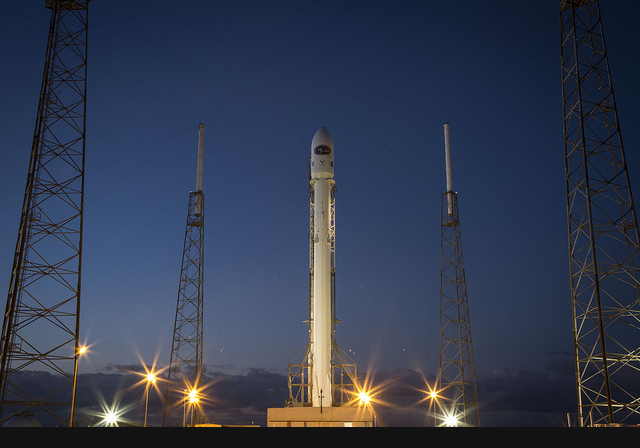

# RLE Image Compression Benchmark

Lossless hybrid RLE compression benchmark on indexed BMP images with three scan modes.

## Overview

- Image variants: `bw_1bit`, `gray_4bit`, `palette_8bit`
- Scan modes: `row_major`, `col_major`, `zigzag_64`
- Default source: `skimage.data.rocket()`
- Preprocess: no resize; top-left aligned per-axis padding with `W' = ceil(W/64)*64`, `H' = ceil(H/64)*64`
- Validation: all encoded files are decoded and compared pixel-by-pixel

## Quick Start

```bash
pip install -r requirements.txt
python run_pipeline.py
```

Run with external input:

```bash
python run_pipeline.py --input-image path/to/image.png
```

## Professional Project Structure

```text
RLE-Image-Compression/
|-- run_pipeline.py                          # CLI entrypoint: runs the full experiment pipeline
|-- requirements.txt                         # Python dependencies
|-- README.md                                # Project documentation
|-- src/
|   `-- rle_image_compression/
|       |-- __init__.py                      # Package marker
|       |-- dataset.py                       # Source loading, dynamic axis-wise padding helpers, BMP variant preparation
|       |-- bmp_codec.py                     # Indexed BMP read/write and header reconstruction
|       |-- scans.py                         # Scan and inverse-scan implementations
|       |-- rle_codec.py                     # Hybrid RLE encode/decode and metrics
|       `-- pipeline.py                      # Orchestration, experiment runs, output generation
|-- images/
|   |-- generated_sources/                   # Prepared source images used in experiments
|   |-- previews/                            # PNG previews for BMP variants
|   |-- block_analysis/                      # Block-level heatmaps (green=good compression, red=negative)
|   |-- bmp/                                 # Generated indexed BMP files
|   |-- decompressed/                        # Decoded BMP files for lossless verification
|   `-- pixel_values/                        # Pixel matrix dumps
|-- encoded/                                 # Serialized RLE outputs (.rle)
|-- results/                                 # CSV/JSON/Markdown benchmark outputs
`-- local/                                   # Local-only report and helper files
```

## Visual Preview

Default source image:



BMP previews:

### bw_1bit


### gray_4bit


### palette_8bit


## Current Benchmark Results

### Global Performance by BMP Type

| BMP Type | Row Major (%) | Col Major (%) | Zigzag 64 (%) | Best Scan |
|---|---:|---:|---:|---|
| bw_1bit | 67.83 | 74.98 | 60.01 | col_major |
| gray_4bit | 22.45 | 25.59 | 12.17 | col_major |
| palette_8bit | 10.00 | 3.61 | -2.26 | row_major |

### Block Winner Counts (64x64)

Current default source is padded to 640x448, so block grid is 10x7 = 70 blocks.
Row/Col/Zigzag/Tie counts therefore sum to 70 for each BMP type.

| BMP Type | Row Wins | Col Wins | Zigzag Wins | Tie Blocks |
|---|---:|---:|---:|---:|
| bw_1bit | 8 | 18 | 2 | 42 |
| gray_4bit | 30 | 39 | 0 | 1 |
| palette_8bit | 55 | 13 | 2 | 0 |

### Full 3x3 Matrix

| BMP Type | Scan Mode | Original (bytes) | Compressed (bytes) | Compression Rate (%) | Compression Performance (%) | Lossless |
|---|---|---:|---:|---:|---:|---|
| bw_1bit | row_major | 35902 | 11548 | 32.17 | 67.83 | True |
| bw_1bit | col_major | 35902 | 8981 | 25.02 | 74.98 | True |
| bw_1bit | zigzag_64 | 35902 | 14359 | 39.99 | 60.01 | True |
| gray_4bit | row_major | 143478 | 111272 | 77.55 | 22.45 | True |
| gray_4bit | col_major | 143478 | 106769 | 74.41 | 25.59 | True |
| gray_4bit | zigzag_64 | 143478 | 126023 | 87.83 | 12.17 | True |
| palette_8bit | row_major | 287798 | 259029 | 90.00 | 10.00 | True |
| palette_8bit | col_major | 287798 | 277404 | 96.39 | 3.61 | True |
| palette_8bit | zigzag_64 | 287798 | 294309 | 102.26 | -2.26 | True |

## Decompressed Outputs

- Single decoded BMP per type (padding removed):
	- `images/decompressed/skimage_rocket/bw_1bit.bmp`
	- `images/decompressed/skimage_rocket/gray_4bit.bmp`
	- `images/decompressed/skimage_rocket/palette_8bit.bmp`
- Original reference image:
	- `images/decompressed/skimage_rocket/source_original.png`

## Block Analysis Visuals

- One heatmap per BMP type (`best block compression performance`, annotated with winning scan mode).
- Heatmap scale is diverging: positive values in green tones, negative values in red tones.
- Tie blocks are marked as `T` (instead of forcing lexicographic assignment).

Generated under:
	- `images/block_analysis/`

## Output Artifacts

- [results/compression_results.csv](results/compression_results.csv)
- [results/compression_results.json](results/compression_results.json)
- [results/block64_results.csv](results/block64_results.csv)
- [results/block64_results.json](results/block64_results.json)
- [results/block64_bmp_scan_comparison.csv](results/block64_bmp_scan_comparison.csv)
- [results/block64_bmp_scan_comparison.json](results/block64_bmp_scan_comparison.json)
- [results/block64_value_features.csv](results/block64_value_features.csv)
- [results/block64_value_features.json](results/block64_value_features.json)
- [results/bmp_scan_summary.csv](results/bmp_scan_summary.csv)
- [results/bmp_scan_summary.json](results/bmp_scan_summary.json)
- [results/results_tables.md](results/results_tables.md)
